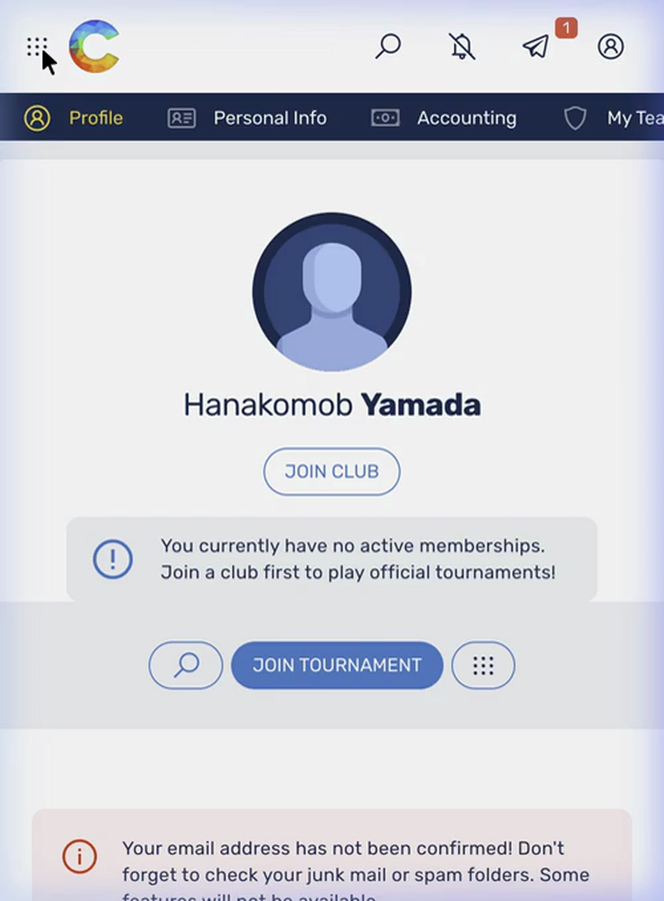
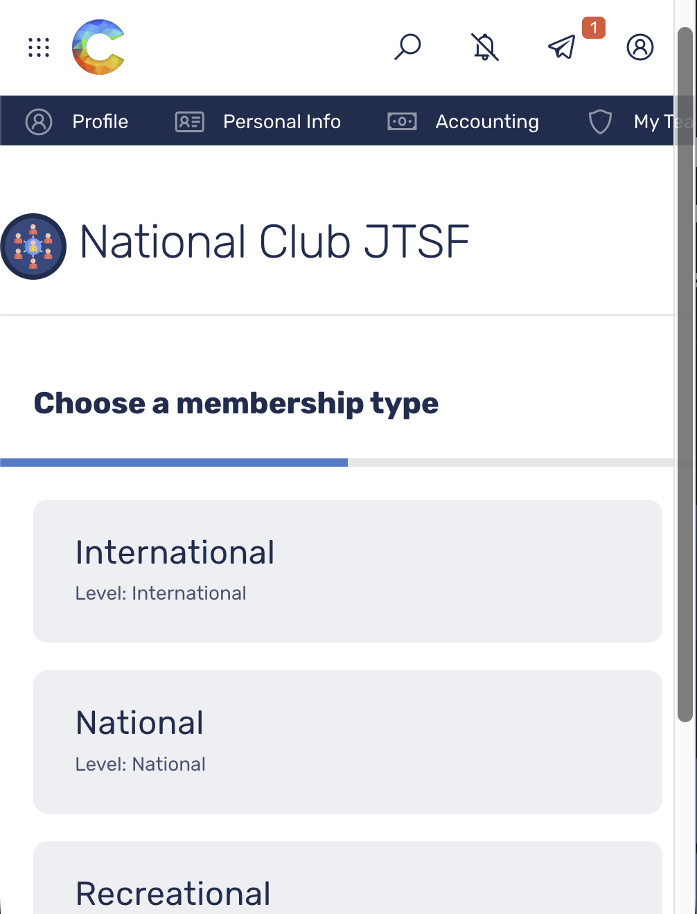
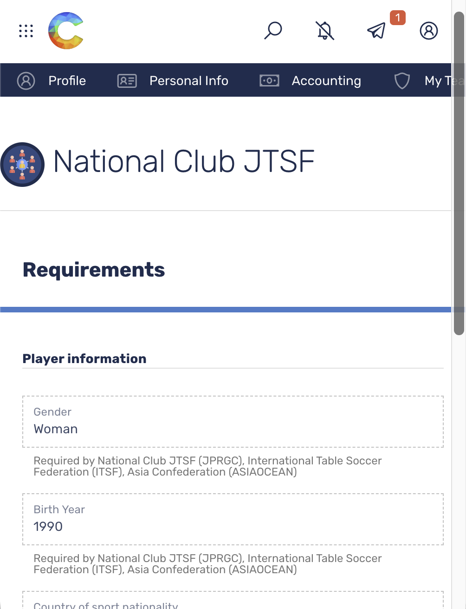
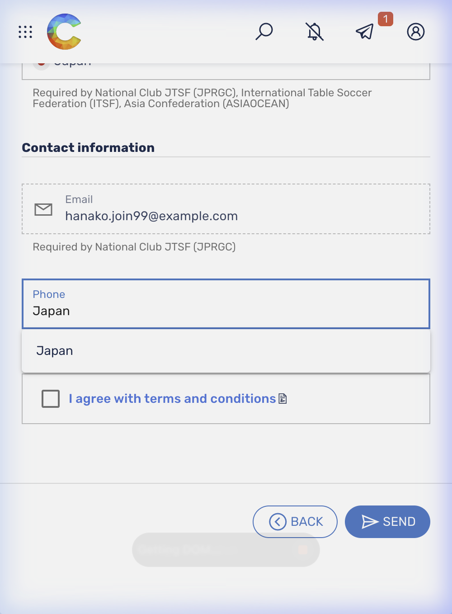
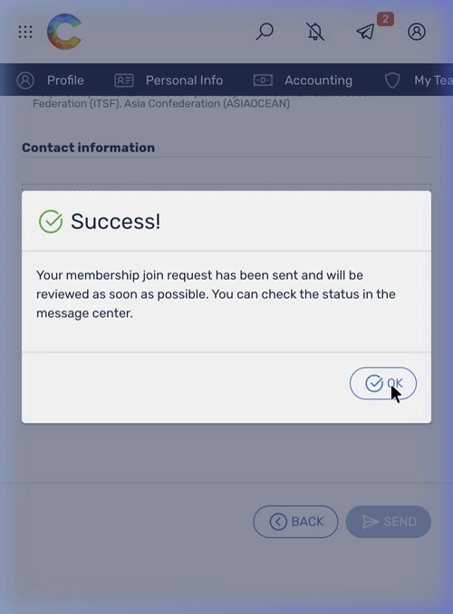

# 🏆 CORAL 所属クラブ登録マニュアル

このマニュアルでは、CORALでのアカウント作成後、自身が所属する組織（クラブ等）へ登録申請を行う手順を解説します。
ここでは例として「National Club JTSF」に所属する手順を紹介します。

---

## 📹 操作手順動画

全体の流れは以下のデモ動画をご参照ください。

---

## 📝 登録手順

### Step 1: クラブ検索と指定
1. ログイン後の画面左上メインメニューを開き、「Join club」をクリックします。
   - ※または、ログイン直後の画面下部にある **「JOIN CLUB」** ボタンからも同様に進むことができます。
2. 検索欄に **「National Club JTSF」** と入力し、該当するクラブの **「JOIN」** ボタンをクリックします。

### Step 2: 内容入力（メンバーシップの選択）
申請フォームにて、まずは一番上の項目を入力します。

**【Choose a membership type】**
今回は表示されているリストの中から **「International」** を選択します。

### Step 3: 要件情報の入力（Requirements）
続いて、プレイヤーに関する要件項目（Requirements）を入力します。

**【Player information】**
- 国籍（Country of sport nationality）はリストから **「Japan」** を選択してください。
- その他の必須項目（**Gender**、**Birth Year** など）もご自身の正確な情報を設定します。

**【Contact information】**
- **Email（メールアドレス）**
  登録されているご自身のメールアドレスが正しく表示されているか確認します（通常は自動で入力されています）。
- **Phone（電話番号の登録）**
  ここは少し入力が難しい箇所です。まず左側の国旗（国コード）部分をタップし、表示される検索ボックスに **「Japan」** と検索・入力して日本（+81）を選択します。その後、右側に電話番号を入力してください。

### Step 4: 登録内容の同意と送信
1. **「I agree with terms and conditions」** のチェックボックスにチェックを入れます。
2. 一番下の **「Send」** ボタンをクリックして登録申請を送信します。
3. 「Success...」といった画面上に申請完了のメッセージが出れば、クラブへの参加申請は完了（承認待ち状態）となります。

---

## ▶ 次のステップ

クラブへの登録（または引き継ぎ申請）が完了したら、実際に大会にエントリーしてみましょう！
👉 **[CORAL 大会エントリーマニュアルへの手順を読む](CORAL_大会エントリーマニュアル.md)**
