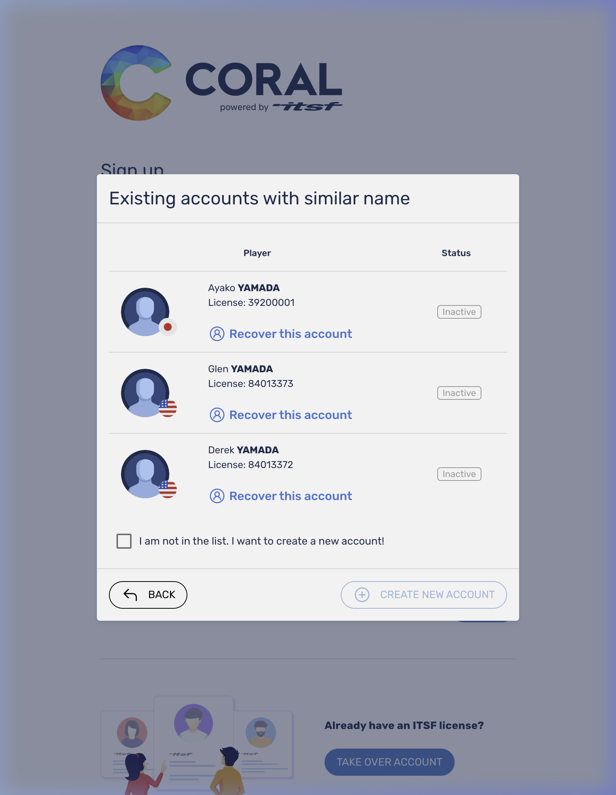
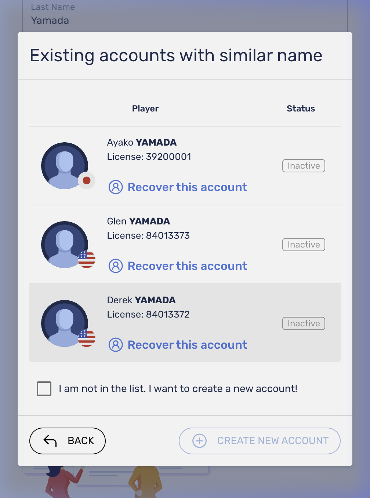
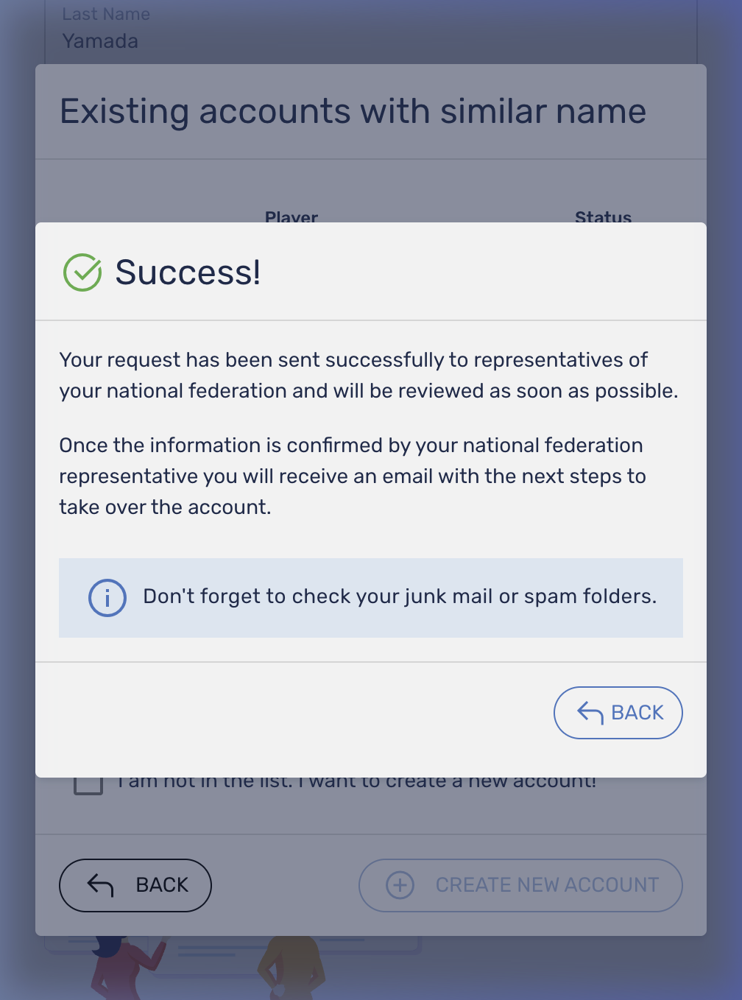
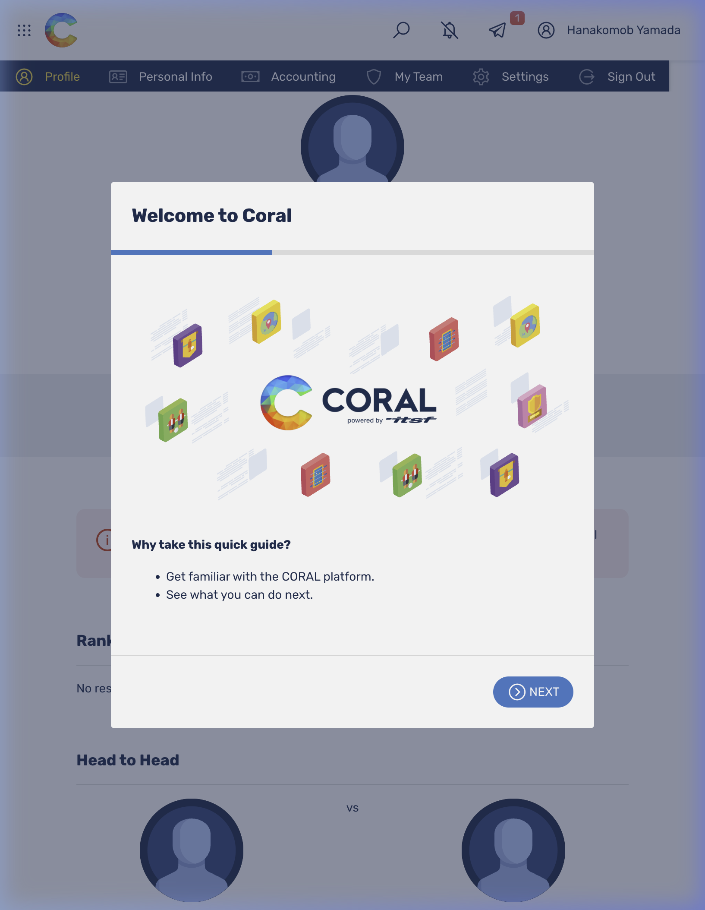

# 📘 CORAL 新規登録およびアカウント引き継ぎマニュアル

**対象URL:** `https://app.tablesoccer.org`
*(※本マニュアルの画面はテスト環境のものです)*

このマニュアルでは、初めてCORALをご利用になる方向けに、新規のアカウント作成から既存データの引き継ぎ（TAKE OVER ACCOUNT）までの手順を解説します。

---

## 📹 操作手順動画

全体の流れは以下のデモ動画をご参照ください。

---

## 📝 手順解説

### Step 1: アカウントの作成（サインアップ）

1. ブラウザで [CORAL (https://app.tablesoccer.org)](https://app.tablesoccer.org) にアクセスします。
2. ログイン画面の下部にある **「Create account」** リンクをクリックします。
3. 登録フォームが表示されるので、以下の情報を入力します：
   - **First Name:** 下の名前
   - **Last Name:** 苗字
   - **Email:** 登録するメールアドレス
   - **Password:** 希望するパスワード
4. 入力が完了したら、**「I agree with terms and conditions（利用規約に同意する）」** のチェックボックスにチェックを入れます。
5. **「SIGN UP」** ボタンをクリックします。

---

### Step 2: アカウントの引き継ぎ・新規作成の選択

サインアップ後、「Existing accounts with similar name」という、**あなたの名前と似ている既存アカウントのリスト**が表示される画面（Take Over Account画面）に移行します。

ここでの対応は、リストに自分のアカウントが存在するかどうかで2パターンに分かれます。

#### 【パターンA】 リストに自分のアカウントがある場合（引き継ぎ）

もし、ITSFなどの過去の成績データがあり、リスト内にご自身の名前・国旗・写真等と一致するアカウントが見つかった場合はこちらの操作を行います。

1. 該当するアカウント（例: Ayako YAMADA）の横にある **「Recover this account」** をクリックします。
2. 確認画面が表示されるので **「CONFIRM」** をクリックして引き継ぎ申請を行います。
3. 申請が完了すると、「Success!」という案内の画面に移行します。

1. 申請後は管理者の **「承認待ち」** ステータスとなり、確認用のメールが届きますのでメールフォルダをご確認の上、そのまましばらくお待ちください。

**▼アカウント引き継ぎ専用デモ動画**

#### 【パターンB】 リストに自分のアカウントがない場合（完全新規）

初めてテーブルサッカーのシステムに登録する方や、過去のデータがない（リストに自分がいない）場合は、こちらの操作で完全に新しいアカウントを作成します。

1. リストの下にある **「I am not in the list. I want to create a new account!（リストにいません。新しいアカウントを作成します）」** のチェックボックスにチェックを入れます。
2. 右下の **「CREATE NEW ACCOUNT」** ボタンをクリックします。
3. 処理が完了すると、自動的にCORALにログインした状態となり、**ホーム画面（Profile画面）** に切り替わります。

これで、新規アカウントの作成および初期設定は完了です！

---

※アカウント作成後のクラブへの登録手順については、別ファイルの **[CORAL 所属クラブ登録マニュアル](CORAL_所属クラブ登録マニュアル.md)** をご覧ください。
